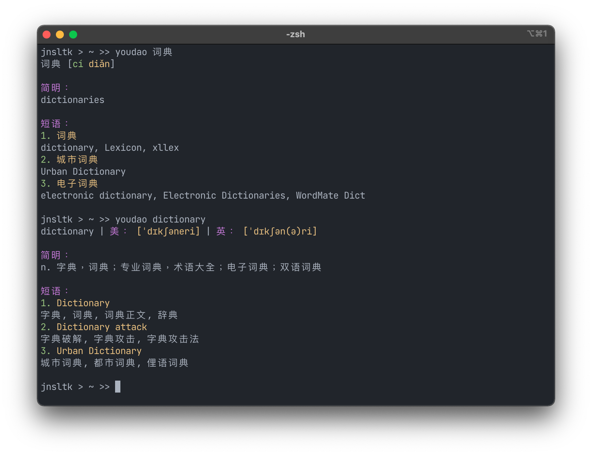

# CLI youdao dictionary client

Yet another command line youdao Chinese dictionary client, written in go. Uses an api key I found on the internet, so not very future proof.\
This project was just a fun way for me to experiment with go.

It features colors, as well pinyin for all Chinese headwords, which is also colored based on the tones. 

It's still a work in progress though, I might add more features or decide to rework the whole thing if I feel like it.

